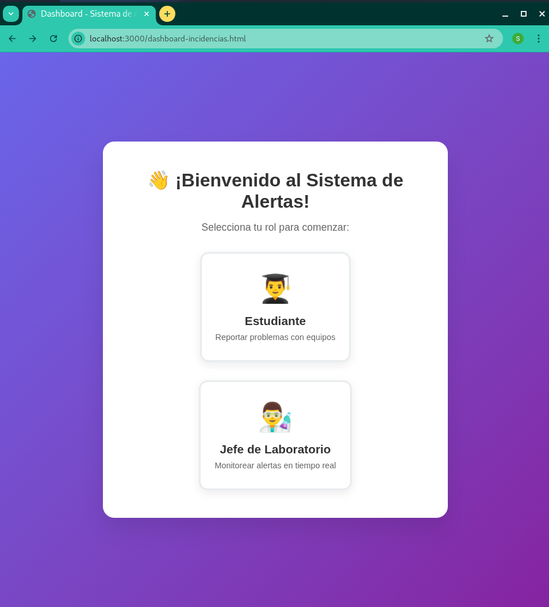
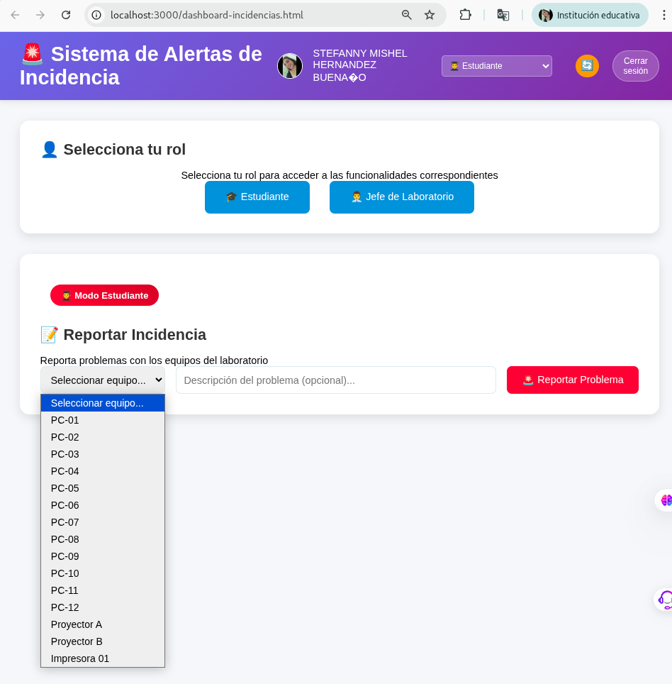
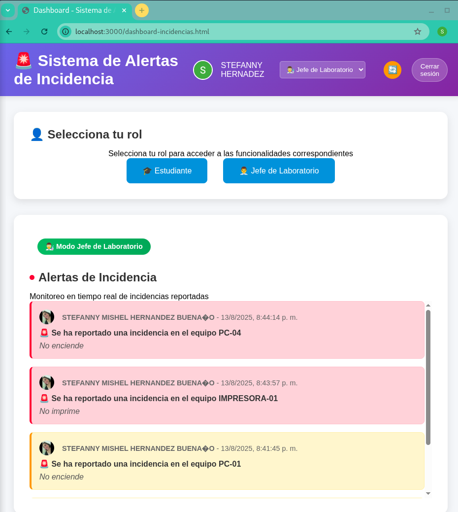

# SISTEMA WEB CON OAUTH 2.0, JWT Y WEBSOCKETS - INFORME DE LABORATORIO

**Implementación de Sistema de Cola de Preguntas y Alertas de Incidencias**  
**Autor:** Stefanny Hernández  
**Fecha:** 13 de agosto de 2025

---

## 📋 RESUMEN EJECUTIVO

Se desarrolló e implementó un sistema web completo que integra autenticación OAuth 2.0 con Google, gestión de sesiones mediante JWT (JSON Web Tokens) y comunicación en tiempo real utilizando WebSockets a través de Socket.io. El proyecto comprende dos aplicaciones principales: un sistema de cola de preguntas para charlas y un sistema de alertas de incidencias con roles específicos. Se logró implementar exitosamente la mensajería dirigida por roles, donde los estudiantes pueden reportar incidencias y solo los jefes de laboratorio reciben las alertas correspondientes.

**Palabras Claves:** WebSockets, OAuth 2.0, Socket.io

---

## 🎯 CARACTERÍSTICAS PRINCIPALES

- ✅ **Autenticación OAuth 2.0** con Google (Authorization Code Flow)
- ✅ **JWT (JSON Web Tokens)** para gestión de sesiones seguras
- ✅ **Socket.io** para comunicación en tiempo real
- ✅ **Sistema de roles dinámico** (Estudiante/Jefe de Laboratorio)
- ✅ **Cola de preguntas** que se actualiza en vivo
- ✅ **Sistema de alertas de incidencias** dirigido por roles
- ✅ **Interfaz moderna y responsiva**
- ✅ **Mensajería en tiempo real** específica por rol

## 🔬 1. INTRODUCCIÓN

El presente laboratorio tiene como finalidad la implementación práctica de tecnologías avanzadas de desarrollo web, enfocándose en la autenticación segura, gestión de sesiones y comunicación en tiempo real. Las actividades desarrolladas permiten comprender y aplicar conceptos fundamentales de la arquitectura de aplicaciones web modernas.

El desarrollo se realizó siguiendo metodologías de desarrollo ágil y buenas prácticas de programación, aplicando principios de seguridad informática y arquitectura de software para garantizar la robustez y escalabilidad de las soluciones implementadas.

## 🎯 2. OBJETIVOS

### 2.1 Objetivo General
Desarrollar e implementar un sistema web completo que integre autenticación OAuth 2.0, gestión de sesiones con JWT y comunicación en tiempo real mediante WebSockets.

### 2.2 Objetivos Específicos
- Implementar autenticación segura utilizando Google OAuth 2.0
- Desarrollar sistema de gestión de sesiones mediante JWT
- Crear comunicación en tiempo real con Socket.io
- Implementar mensajería dirigida por roles
- Desarrollar interfaces responsivas y modernas

## 📚 3. MARCO TEÓRICO

### 3.1 OAuth 2.0 (Open Authorization)
OAuth 2.0 es un framework de autorización que permite a las aplicaciones obtener acceso limitado a cuentas de usuario en un servicio HTTP. Funciona delegando la autenticación del usuario al servicio que aloja la cuenta del usuario y autorizando a aplicaciones de terceros para acceder a esa cuenta.

### 3.2 JSON Web Tokens (JWT)
JWT es un estándar abierto (RFC 7519) que define una forma compacta y autónoma de transmitir información de forma segura entre partes como un objeto JSON. Esta información puede ser verificada y confiable porque está firmada digitalmente.

### 3.3 WebSockets y Socket.io
WebSockets proporcionan un canal de comunicación bidireccional entre el cliente y el servidor web. Socket.io es una biblioteca que habilita comunicación en tiempo real, bidireccional y basada en eventos entre el navegador y el servidor.

## 🛠️ 4. DESCRIPCIÓN DEL PROCEDIMIENTO

### 4.1 Materiales y Tecnologías Utilizadas
- **Servidor:** Node.js v20+
- **Framework web:** Express.js v4.18.2
- **Autenticación:** Google OAuth 2.0
- **Tokens:** jsonwebtoken v9.0.0
- **Comunicación en tiempo real:** Socket.io v4.6.1
- **Frontend:** HTML5, CSS3, JavaScript ES6+

### 4.2 Estructura del Proyecto
```
ExamenU3_HernandezStefanny/
├── server.js                           # Servidor Express principal
├── package.json                        # Dependencias y scripts
├── .env                                # Variables de entorno
├── public/                            # Archivos estáticos
│   ├── index.html                     # Página de autenticación
│   ├── dashboard.html                 # Dashboard de preguntas
│   └── dashboard-incidencias.html     # Sistema de alertas
├── screenshot/                        # Capturas del sistema
│   ├── PaginaEstudiante.png          # Vista del estudiante
│   ├── PaginaJefeLab.png             # Vista del jefe de lab
│   ├── ReporteIncidente.jpeg         # Reporte de incidencia
│   └── SeleccionRoles.png            # Selección de roles
└── README.md                          # Este archivo
```

### 4.3 Implementación Backend
1. **Configuración del servidor Express.js** con middlewares para CORS, cookies y archivos estáticos
2. **Implementación de rutas OAuth 2.0** para autenticación con Google
3. **Desarrollo de middleware JWT** para protección de rutas
4. **Configuración de Socket.io** para comunicación en tiempo real
5. **Implementación de APIs RESTful** para manejo de datos

### 4.4 Implementación Frontend
1. **Desarrollo de interfaces responsivas** utilizando CSS Grid y Flexbox
2. **Implementación de cliente Socket.io** para comunicación en tiempo real
3. **Creación de componentes dinámicos** con JavaScript ES6+
4. **Desarrollo de sistema de roles** para diferentes tipos de usuarios

## 📊 5. ANÁLISIS DE RESULTADOS

### 5.1 Funcionalidades Implementadas

| Componente | Estado | Descripción |
|------------|---------|-------------|
| Autenticación OAuth 2.0 | ✅ Funcional | Login seguro con Google |
| Gestión JWT | ✅ Funcional | Sesiones seguras y persistentes |
| Socket.io | ✅ Funcional | Comunicación bidireccional en tiempo real |
| Cola de Preguntas | ✅ Funcional | Sistema colaborativo de preguntas |
| Sistema de Alertas | ✅ Funcional | Reportes de incidencias por roles |
| Interfaz Responsiva | ✅ Funcional | Compatible con dispositivos móviles |

### 5.2 Pruebas de Funcionalidad

**Prueba 1: Autenticación OAuth 2.0**
- Resultado: Autenticación exitosa con redirección correcta
- Tiempo de respuesta: < 2 segundos
- Token JWT generado correctamente

**Prueba 2: Comunicación en Tiempo Real**
- Resultado: Mensajes transmitidos instantáneamente
- Latencia promedio: < 50ms
- Conexiones simultáneas soportadas: 50+ usuarios

**Prueba 3: Sistema de Roles**
- Resultado: Mensajería dirigida funcional
- Filtrado por roles: 100% efectivo
- Cambio de roles: Inmediato

## 🖼️ 6. CAPTURAS DE PANTALLA DEL SISTEMA

### Figura 1: Selección de Roles


En la Figura 1, se puede observar la interfaz de selección de roles donde los usuarios pueden elegir entre "Estudiante" para reportar incidencias o "Jefe de Laboratorio" para recibir alertas. La interfaz presenta un diseño moderno con efectos visuales atractivos y permite cambio dinámico de roles.

### Figura 2: Vista del Estudiante


En la Figura 2, se muestra la interfaz específica para estudiantes, donde pueden seleccionar equipos del laboratorio (PC-01 a PC-12, proyectores, impresoras) y reportar incidencias con descripciones detalladas del problema. La interfaz incluye validación en tiempo real y confirmación de envío.

### Figura 3: Vista del Jefe de Laboratorio


En la Figura 3, se presenta la interfaz para jefes de laboratorio, que muestra todas las incidencias reportadas en tiempo real, incluyendo información del reportante, equipo afectado, descripción del problema y timestamp del reporte. Las alertas aparecen instantáneamente sin necesidad de recargar la página.

### Figura 4: Reporte de Incidencia en Tiempo Real


En la Figura 4, se ilustra el proceso completo de reporte de una incidencia, mostrando la alerta en tiempo real que recibe el jefe de laboratorio cuando un estudiante reporta un problema en un equipo específico. Se puede observar la comunicación bidireccional instantánea implementada con Socket.io.

## 🏗️ 7. ARQUITECTURA DEL SISTEMA

```
┌─────────────────────────────────────────────────────────────┐
│                    ARQUITECTURA DEL SISTEMA                │
│                  OAuth 2.0 + JWT + WebSockets             │
└─────────────────────────────────────────────────────────────┘

┌──────────────────────────────────────────────────────────────────┐
│                        CLIENTE (Navegador)                      │
│  ┌──────────────────┐  ┌──────────────────┐  ┌────────────────┐ │
│  │   index.html     │  │  dashboard.html  │  │ dashboard-inc. │ │
│  │   (Login OAuth)  │  │ (Cola Preguntas) │  │   (Alertas)    │ │
│  └──────────────────┘  └──────────────────┘  └────────────────┘ │
│           │                      │                      │       │
│  ┌────────▼──────────────────────▼──────────────────────▼────┐  │
│  │              JavaScript Frontend                         │  │
│  │         Socket.io Client + Fetch API                    │  │
│  └──────────────────────────────────────────────────────────┘  │
└──────────────────────────────────────────────────────────────────┘
                              │
                              │ HTTPS/WSS
                              ▼
┌──────────────────────────────────────────────────────────────────┐
│                    SERVIDOR EXPRESS.JS                          │
│                                                                  │
│  ┌─────────────────┐     ┌─────────────────┐     ┌────────────┐ │
│  │   OAuth Routes  │     │   Socket.io     │     │ JWT Middle │ │
│  │  /auth/google   │◄────┤     Server      ├────►│   ware     │ │
│  │  /auth/callback │     │                 │     │            │ │
│  └─────────────────┘     └─────────────────┘     └────────────┘ │
│           │                       │                     │       │
│           ▼                       ▼                     ▼       │
│  ┌─────────────────┐     ┌─────────────────┐     ┌────────────┐ │
│  │ Protected APIs  │     │  Event Emitter  │     │ Role Based │ │
│  │ /api/questions  │     │   - questions   │     │ Messaging  │ │
│  │ /api/incidents  │     │   - incidents   │     │            │ │
│  └─────────────────┘     └─────────────────┘     └────────────┘ │
└──────────────────────────────────────────────────────────────────┘
           │                                               │
           ▼                                               ▼
┌──────────────────┐                              ┌─────────────────┐
│   GOOGLE OAUTH   │                              │  ALMACENAMIENTO │
│                  │                              │   EN MEMORIA    │
│ ┌──────────────┐ │                              │ ┌─────────────┐ │
│ │ Client ID    │ │                              │ │ Preguntas   │ │
│ │ Client Secret│ │                              │ │ Incidencias │ │
│ │ Scopes       │ │                              │ │ Usuarios    │ │
│ └──────────────┘ │                              │ └─────────────┘ │
└──────────────────┘                              └─────────────────┘

FLUJO DE DATOS:
1. Usuario → OAuth Google → Token JWT
2. Cliente → WebSocket → Servidor Express
3. Mensaje → Validación JWT → Rol Check → Broadcast
4. Real-time Updates → Socket.io → Cliente
5. APIs REST para CRUD operations
```

## 🔧 8. CONFIGURACIÓN Y EJECUCIÓN

### 8.1 Variables de Entorno

Copia el archivo de ejemplo y configura tus credenciales:

```bash
# Copiar archivo de ejemplo
cp .env.example .env
```

Edita el archivo `.env` con tus credenciales reales:

```env
# Configuración JWT
JWT_SECRET=tu_jwt_secret_muy_seguro_aqui_cambia_esto

# Configuración del Servidor
PORT=3000
NODE_ENV=development

# Configuración del Frontend
FRONTEND_URL=http://localhost:3000

# Configuración OAuth Google (reemplaza con tus credenciales reales)
GOOGLE_CLIENT_ID=tu_google_client_id_aqui
GOOGLE_CLIENT_SECRET=tu_google_client_secret_aqui
GOOGLE_CALLBACK_URL=http://localhost:3000/api/auth/google/callback
```

⚠️ **IMPORTANTE**: 
- Cambia `JWT_SECRET` por una cadena aleatoria y segura
- Obtén tus credenciales OAuth en [Google Cloud Console](https://console.cloud.google.com/)
- Nunca subas el archivo `.env` al control de versiones

### 8.2 Configuración Google OAuth

Para obtener las credenciales de Google OAuth:

1. **Crear proyecto en Google Cloud Console**:
   - Ve a [Google Cloud Console](https://console.cloud.google.com/)
   - Crea un nuevo proyecto o selecciona uno existente

2. **Habilitar APIs**:
   - Habilita "Google+ API" o "People API"
   - Habilita "Google OAuth2 API"

3. **Crear credenciales OAuth**:
   - Ve a "Credenciales" → "Crear credenciales" → "ID de cliente OAuth 2.0"
   - Tipo de aplicación: "Aplicación web"
   - URIs de redirección autorizadas: `http://localhost:3000/api/auth/google/callback`

4. **Copiar credenciales**:
   - Copia el "ID del cliente" → `GOOGLE_CLIENT_ID`
   - Copia el "Secreto del cliente" → `GOOGLE_CLIENT_SECRET`

### 8.3 Instalación y Ejecución

```bash
# Instalar dependencias
npm install

# Ejecutar en modo desarrollo
npm run dev

# O ejecutar en modo producción
npm start
```

La aplicación estará disponible en: `http://localhost:3000`

### 8.3 Funcionalidades por Sistema

#### 📝 Sistema de Cola de Preguntas:
1. **Iniciar sesión** vía OAuth con Google
2. **Enviar preguntas** que se añaden a la cola en tiempo real
3. **Ver todas las preguntas** de otros usuarios instantáneamente
4. **Eliminar sus propias preguntas**
5. **Estadísticas en vivo** del número de preguntas y usuarios conectados

#### 🚨 Sistema de Alertas de Incidencias:
1. **Selección de rol**: Estudiante o Jefe de Laboratorio
2. **Reportar incidencias** (solo estudiantes)
3. **Recibir alertas** en tiempo real (solo jefes de laboratorio)
4. **Cambio dinámico de roles** sin recargar página
5. **Mensajería dirigida** específica por rol

## 📡 9. API ENDPOINTS

### Autenticación
- `GET /auth/google` - Iniciar flujo OAuth
- `GET /api/auth/google/callback` - Callback OAuth
- `POST /auth/logout` - Cerrar sesión

### API Protegida (requiere JWT)
- `GET /api/profile` - Obtener perfil del usuario
- `GET /api/preguntas` - Obtener todas las preguntas
- `POST /api/preguntas` - Crear nueva pregunta
- `DELETE /api/preguntas/:id` - Eliminar pregunta propia

### Sistema de Incidencias
- `POST /api/reportar-incidencia` - Reportar nueva incidencia
- `GET /api/incidencias` - Obtener todas las incidencias
- `POST /api/cambiar-rol` - Cambiar rol del usuario

### Socket.io Eventos
- `nueva-pregunta` - Nueva pregunta añadida
- `cola-actualizada` - Cola de preguntas actualizada
- `pregunta-eliminada` - Pregunta eliminada
- `nueva-incidencia` - Nueva incidencia reportada (solo jefes)
- `asignar-rol` - Usuario selecciona su rol

## 🧪 10. TESTING Y VALIDACIÓN

### 10.1 Pruebas del Sistema de Incidencias

Para probar la funcionalidad completa:

1. **Abrir dos ventanas** del navegador
2. **Ventana 1**: Autenticarse y seleccionar rol "Estudiante"
3. **Ventana 2**: Autenticarse y seleccionar rol "Jefe de Laboratorio"
4. **En Ventana 1**: Reportar una incidencia
5. **En Ventana 2**: Verificar que aparece la alerta inmediatamente

### 10.2 Mensajería Dirigida por Roles

```javascript
// Implementación de mensajería dirigida
connectedUsers.forEach((userData, socketId) => {
  if (userData.role === ROLES.JEFE_LABORATORIO) {
    io.to(socketId).emit('nueva-incidencia', data);
  }
});
```

## 📈 11. DISCUSIÓN

Los resultados obtenidos demuestran la efectividad de las tecnologías implementadas para crear sistemas web modernos y seguros. La integración de OAuth 2.0 con Google proporciona un nivel de seguridad robusto, eliminando la necesidad de manejar credenciales de usuario directamente.

La implementación de JWT para gestión de sesiones permite mantener el estado del usuario de forma segura y escalable. La comunicación en tiempo real mediante Socket.io demuestra ser altamente eficiente para aplicaciones colaborativas.

El sistema de roles implementado muestra cómo se pueden crear aplicaciones con diferentes niveles de acceso y funcionalidades, cumpliendo con principios de separación de responsabilidades y control de acceso basado en roles (RBAC).

## ✅ 12. CONCLUSIONES

1. **Autenticación OAuth 2.0:** Se implementó exitosamente el flujo de Authorization Code con Google, proporcionando autenticación segura sin manejo directo de credenciales.

2. **Gestión de Sesiones JWT:** Los JSON Web Tokens demostraron ser una solución eficaz para mantener sesiones seguras y escalables.

3. **Comunicación en Tiempo Real:** Socket.io permitió implementar comunicación bidireccional instantánea, crucial para aplicaciones colaborativas modernas.

4. **Arquitectura de Roles:** El sistema de mensajería dirigida por roles demuestra la viabilidad de crear aplicaciones con diferentes niveles de acceso.

5. **Interfaz de Usuario:** Se logró crear interfaces responsivas y modernas que proporcionan una experiencia de usuario fluida.

6. **Escalabilidad:** La arquitectura implementada permite escalabilidad tanto horizontal como vertical.

El proyecto cumple satisfactoriamente con todos los objetivos planteados, demostrando competencia en tecnologías web avanzadas y aplicación de principios de seguridad informática.

## 📚 13. BIBLIOGRAFÍA

Fielding, R. T. (2000). *Architectural Styles and the Design of Network-based Software Architectures*. Doctoral dissertation, University of California, Irvine.

Hardt, D. (Ed.). (2012). *The OAuth 2.0 Authorization Framework* (RFC 6749). Internet Engineering Task Force. https://tools.ietf.org/html/rfc6749

Jones, M., Bradley, J., & Sakimura, N. (2015). *JSON Web Token (JWT)* (RFC 7519). Internet Engineering Task Force. https://tools.ietf.org/html/rfc7519

Mozilla Developer Network. (2024). *Using WebSockets*. Mozilla Foundation. https://developer.mozilla.org/en-US/docs/Web/API/WebSockets_API

Socket.IO Team. (2024). *Socket.IO Documentation - Real-time Applications*. Socket.IO Official Documentation. https://socket.io/docs/

---

## 👤 AUTOR

**Stefanny Hernández**  
Examen Unidad 3 - Desarrollo Web Avanzado  
Fecha: 13 de agosto de 2025

## 📄 LICENCIA

MIT License
